## # 1강
■ 요약
• 숲은 물리적인 측면뿐만 아니라 인문·사회적인 측면도 포함하고 있으므로 숲에 대한 의미를 보 다 포괄적으로 해석한다.
• 산림이란 집단적으로 자라고 있는 나무와 토지, 암석지, 소택지 등이 포함된 것을 의미하며, 일 본에서는 수목뿐만 아니라 숲에 존재하는 다양한 생물을 포함한 총체적인 것을 의미하고 있다.
• 숲은 소유 주체에 따라 국유림과 사유림으로 구분하며, 조성방식에 따라서는 천연적인 숲과 인 공적인 숲으로 구분한다. 이용 목적에 따라서는 경제림, 보안림으로 구분하는데, 보안림은 공공의 안전과 복지 증진을 위해 목적에 따라 다양하게 구분된다.
• 숲은 기후 분포에 따라 열대우림, 난대림, 온대림, 한대림으로 구분하며, 수목의 구성에 따라 침엽수림, 활엽수림, 성상에 따라 상록성, 낙엽성 등으로 구분한다.

### 제1장 숲의 정의
#### 1.1 숲의 정의

##### # 숲의 정의
  - 본 교재에서는 산림, 녹지, 임야 등을 광의의 의미로 해석하여 ‘숲’이라는 용어를 사용하는 것을 원칙으로 함 다만, 기술하는 내용에 따라 법률·행정적 용어를 사용하거나 고유명사로 통용되고 있는 경우에는 <b>‘산림’</b> 또는 <b>‘녹지’</b>라는 용어를 혼용하여 사용
  - 다만, 기술하는 내용에 따라 법률·행정적인 용어를 사용하거나 고유명사로 통용되고 있는
    경우에는 ‘산림’ 또는 ‘녹지’라는 용어를 혼용하여 사용

##### # 사전적 의미와 생태학적 의미
  - 사전적 의미
    - 수풀의 준말 : 나무가 무성하게 우거지거나 풀,나무,덩굴등이 한데 얽힌 것
    - 藪(숲 수): 덤블, 수풀을 의마하며, 초목이 우거지고 새,짐승이 사는 곳
  - 생태학적인 의미
    - 수목이 다수를 점하는 식물과 동물의 자연적인 집합체
  - 생물학적인 의미
    - 나무와 풀등이 우거진 모습을 말하는 것으로 집단으로 자라고 있으며, 서로 경쟁 상태에 놓여 있어야함
    - 독립적이기보다 나무 등 숲을 둘러싸고 있느 환경요소도 고려하여 파악되어야 함
  - 도시숲을 통해서 본 의미
    - 법적,물리적 공간개념을 넘어 환경,생태적 측면과 더불어 문화,전통적 측면을 포함하는 개념

##### # 『숲과 삶』 에서 숲의 의미
  - 도시에 인구가 집중되어 있고 도시확산에 의한 개발로 많은 숲이 사라지고 있는 반면, 
    개발지에 새롭게 조성되는 다양한 숲공간이 형성됨 
    숲의 의미를 ‘산림’과 같이 전통적인 의미 해석보다 시대적인 흐름에 맞추어 다양한 공간 속에서
    인간과 자연이 공존해 가는 개념에서 보다 포괄적으로 숲의 의미 이해

#### 1.2 숲과 유사한 용어
##### # 산림자원의 조성 및 관리에 관한 법률
  - 집단적으로 자라고 있는 입목·죽과 그 토지
  - 집단적으로 자라고 있던 입목·죽이 일시적으로 없어지게 된 토지
  - 입목 ·죽을 집단적으로 키우는 데 사용하게 된 토지
  - 산림의 경영 및 관리를 위하여 설치한 도로(임도)
  - 입목죽 자라고 있거나 임도의 토지에 있는
  - 암석지(巖石地)와 소택지(沼澤地)
##### # 숲과 유사한 용어
  - **산림(forest)** : 
    수목이 밀집하고 있는 장소, 집단의 수목뿐만 아니라
    삼림에 존재하는 다양한 생물이나 토양을 포함하여
    총체적인 의미
  - **임야 (林野)**:
    숲과 들을 함께 부르는 말이며 주로 법률이나
    임업, 생태학 등에서 많이 쓰임
  - **식생(vegetation)** :
    주로 생태학에서 쓰이는 용어, 지구상 육지의 어느 장소에서든
    자라고 있는 식물의 집단(식물이 피복되어 있는 것)
  - **수목(woody plant)** :
    목질로 된 줄기를 가지고 있는 여러해살이식물을
    말하며, 식물학적 분류에 해당되는 용어
##### # 숲과 유사한 용어
  - **공원녹지** :
    쾌적한 도시환경을 조성하고 시민의 휴식과 정서함양에 기여하는
    공간 또는 시설로 도시공원을 비롯한 다양한 공간에서 나무와 풀이
    자라는 곳(도시공원 및 녹지 등에 관한 법률)
  - **녹지** :
    자연환경을 지니고 있는 오픈 스페이스(open space)의 총칭
     ** 광의의 의미** : 공원, 하천, 산림, 농경지 포함한 오픈 스페이스
     ** 협의의 의미** : 법률적 의미의 시설녹지(경관, 완충, 연결)

#### 1.3 숲의 종류
##### # 소유주체에 따른 숲
  - 국유림 : 국가가 소유하고 관리하는 숲 (산림청 관리 국유림, 다른 부처 관리 국유림)
     요존국유림 : 임업생산지확보, 임업기술개발, 학술연구/ 사적, 성지 / 생태계보전, 상수원보호
     불요존국유림 : 요존국유림에 해당되지 않는 국가 소유 숲
  - 사유림 : 개인, 종교단체, 기업 등이 소유하는 숲
  - 공유림 : 지방자치단체, 공공단체가 소유하는 숲

#### 참고 : 요존 국유림 要存國有林 :
> 산림 경영, 학술 연구, 임업 기술 개발을 목적으로, 또는 문화재, 생태계, 상수원 따위를 보호하려는 공익상의 이유로 국가 소유로 보존할 필요가 있는 산림. 산림청의 관할하에 있으며, 매각이나 교환을 통해 민간에게 처분할 수 없다.

> 要: 중요할 요
  存: 있을 존
  國: 나라 국
  有: 있을 유
  林: 수풀 림 수풀 임

##### # 조성방식에 따른 숲
  - 천연적인 숲(naural forest)
    - 인위적인 힘이 가하지 않은 자연적인 숲
    - 산불, 인간의 간섭에 의해 피해를 받기도 함
  - 인공적인 숲(artificial forest)
    - 인위적으로 조성된 숲

##### # 이용목적에 따른 숲
  - 경제림(commercial forest)
    - 숲의 직접적인 효용을 위해서 경경되는 숲
    - 목재,수피,수실(樹實),수지(樹脂)등 화폐로 바꿀 수 있는 물질 생산을 목표로 하는 숲
  - 용재림, 연료림, 풍치림, 방재림, 시험림, 보건휴양림, 야생동식물 보호림, 바잉오 순환림

##### # 기능에 따른 숲
  - 수원함양림 : 수자원함양과 수질정화를 위하여 필요한 산림
  - 산지재해방지림 : 산사태, 토사유출 등 산림재해의 방지 및 임지의 보전에 필요한 산림
  - 자연환경보전림 : 생태,문화,역사,경관,학술적 가치의 보전에 필요한 산림
  - 목재생산림 : 생태적 안정을 기반으로 하여 국민경제활동에 필요한 양질의 목재를 지속적,효율적으로 생산,공급할 수 있는 산림
  - 산침휴양림 : 산림휴양 및 휴식공간의 제공을 위하여 필요한 산림
  - 생활환경보전림 : 도시 또는 새활권 주변의 경관유지, 쾌적한 생활환경의 유지를 위하여 필요한 산림

##### # 기후분포에 따른 숲
  - 열대우림(tropical rain forest) :
    연중 기온이 높고 비가 많이 내리는 적도 부근에 분포하는 숲
  - 온대림(temperate forest) : 사철이 뚜렷한 온대지방의 숲
  - 난대림(sub-tropical forest) : 열대와 온대의 경계에 있는 숲
  - 한대림(frigid forest) : 고원 및 고산을 차지하는 연평균기온 6℃ 이하인 
    지역의 숲(침엽수가 주요수종)

##### # 기후분포에 따른 숲
  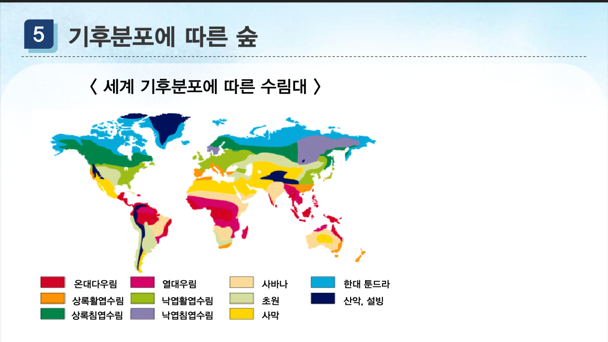

##### # 수목구성에 따른 숲
  - **침염수림**
     주로 침엽수로 구성된 숲
     나자식물(裸子植物)
     소나무, 향나무, 주목, 비자나무 등

  - **활엽수림**
     주로 활엽수로 구성된 숲
     피자식물(被子植物)
     참나무류, 서어나무, 물푸레나무 등

#### 참고 : 나자식물 裸子植物 :
> 밑씨가 씨방 안에 있지 않고 드러나 있는 식물. 가루받이 때 꽃가루가 밑씨 위에 바로 붙는다. 꽃잎은 없으며, 줄기에는 형성층이 발달하였으나 물관이 없고 헛물관을 갖는다. 소나무, 소철, 잣나무, 전나무, 은행나무 따위가 있다.

> 裸: 벌거벗을 라 벌거벗을 나

#### 참고 : 피자식물 被子植物 :
> 꽃식물 가운데 밑씨가 씨방 안에 싸여 있는 식물. 쌍떡잎식물과 외떡잎식물로 크게 나누는데, 감나무ㆍ버드나무ㆍ벚나무ㆍ밤나무ㆍ진달래ㆍ국화ㆍ벼ㆍ난초ㆍ백합 따위 대부분의 종자식물이 이에 해당한다.
어휘 명사 한자어 식물

> 被: 입을 피
  子: 아들 자
  植: 심을 식 둘 치
  物: 만물 물

##### # 수목구성에 따른 숲
  - **상록수림**
     일년 내내 푸른 모습을 지니고 있는 숲
     상록침엽수림과 상록활엽수림
  - **낙엽수림**
     가을과 겨울 사이에 잎이 떨어지고 봄에 새 잎이
    나오는 나무로 구성된 숲
     낙엽침엽수림(메타세콰이어, 은행나무), 낙엽활엽수림

##### # 수목구성에 따른 숲
  - 상록침엽수림 - 소나무숲, 활엽수림 - 서어나무 숲
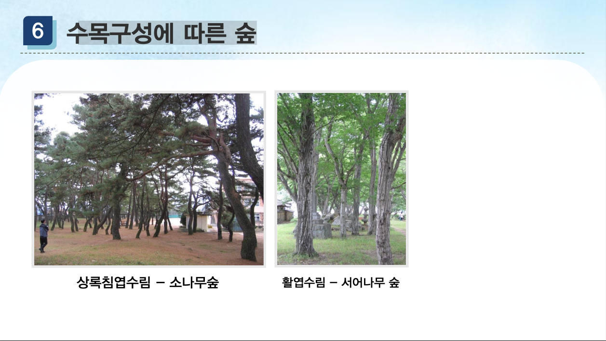

#### 참고 : 서어나무 :
> 자작나뭇과의 낙엽 활엽 교목. 높이는 15미터 정도이며, 잎은 어긋나고 타원형 또는 긴 달걀 모양으로 가장자리에 톱니가 있다. 암수한그루로 5월에 잎보다 꽃이 먼저 피고, 웅화수와 자화수는 밑으로 처지며, 자화수는 대가 있다. 열매는 견과(堅果)로 산지(山地)에 나는데 한국의 중부 이남, 일본, 중국 등지에 분포한다.

#### 참고 : 교목 喬木 :
> 줄기가 곧고 굵으며 높이가 높은 나무. 나무의 줄기와 가지의 구별이 뚜렷하며 주로 위쪽에 가지가 퍼져 있다.
어휘 명사 한자어 식물

> 喬: 높을 교

##### # 수종의 혼합상태에 따른 숲
  - **단순림(순림)**
     숲을 구성하고 있는 나무의 종류가 하나
     잣나무, 삼나무 등 주로 경제적인 이용 목적으로 식재
  - **혼합림(혼교림, 혼효림)**
     두 가지 이상의 나무가 섞여 구성된 숲
     생물학적- 생물다양성, 경관적- 아름다움

  - 삼나무 단순림, 혼효림
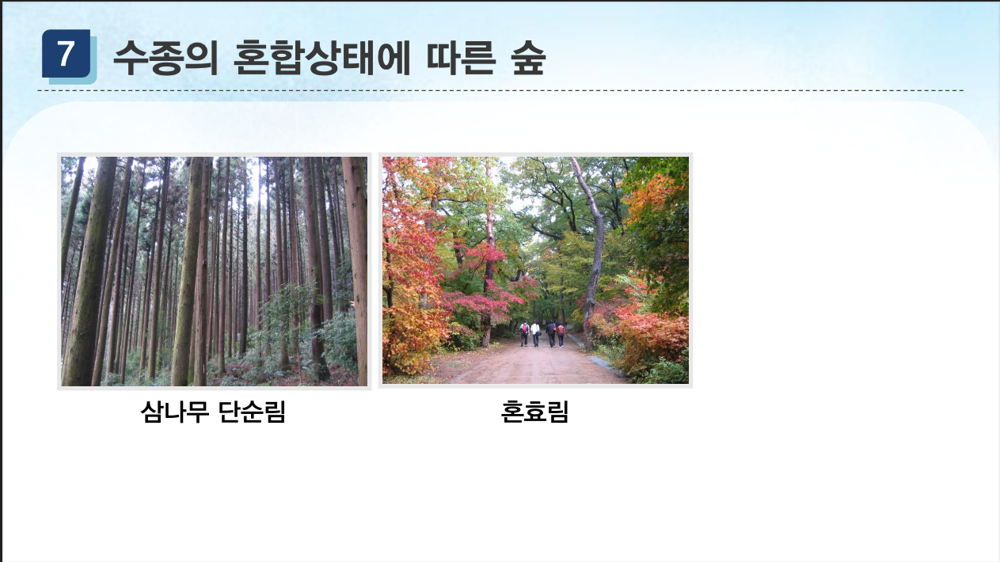

### 제2장 숲의 기능과 가치(1)
#### 2.1 개요

##### # 숲의 공익적 기능과 평가
  - 숲이 가지고 있는 기능을 공익적 기능이라고 함
         경제기능 : 목재, 부산물 공급
         환경기능 : 수자원함양, 국토보전, 산소공급, 휴양장소 제공
         문화기능 : 문학, 예술, 종교적 배

  - 숲의 공익적 기능은 경제학에서 말하는 공공재의 특질,
    즉 배제불가능성(排除不可能性)과 소비의 집단성이라는
    성질을 갖추고 있음
    - 숲의 기능도 정량적으로 계측한 뒤 사회적으로 평가 되어야 함

#### 참고 : 공공재 公共財 :
> 공중(公衆)이 공동으로 사용하는 물건이나 시설. 도로, 항만, 교량, 공원 따위를 이른다.

#### 참고 : 배제 불가능성 排除不可能性 :
> 어떤 재화를 소비하는 대상에서 대가를 지불하지 않은 사람을 제외할 수 없는 성질.

##### # 생태계서비스 평가체계
  - 개념 :
    - 인간이 자연의  다양한 생태계 기능으로 부터 직간접적으로 얻는 이익의 총칭
    - 새천년생태계평가(MA:Millennium Ecosystem Assemssment)
        - 20세기에 들어 과도한 환경이용에 따른 환경훼손, 기후변화, 생물다양성 감소 등 우려
        - 유엔주도 세계 전문가들이 모여 지구생태계에 대한 종합 평가 수행
    - MA의 목표 : 
      - 생태계와 인간복지의 연결고리를 기반으로 관련정책의
        의사결정지원을 위한 과학적 정보 제공
    - 지구생태계 현황진단 및 향후 예상되는 개별
        생태계의 질적·양적 변화, 이러한 변화가 가져올
        인간복지의 변화 및 정책결정 차원에서 대응책 등을 포괄적으로 다룸

    - **MA는 인간에게 주는 서비스 4개 범주로 구분**
         공급서비스(providing services) : 음식, 목재, 연료 등 제공
         조절서비스(regulating services) : 대기질 조절, 기후조절, 질병조절 등
         지원서비스(supporting services), : 광합성, 토양 생성, 영양 순환, 서식지 공급 등
         문화서비스(cultural services) : 문화적 다양성과 종교와 성소로서의 가치, 심미적 가치 등       
#### 2.2 공급서비스의 숲
##### # 수질정화
  - 수원함양기능 가운데 하나로 산림에서 유출된 물을 맑은 물로 정화시키는 작용
  - 부영화 원인의 오염물질의 농도 낮추고(질소, 인 등), 산성비의 산도 중화
  - 산림토양을 통과하면서 흡착과 교환을 통해 맑게 정화
  - 잘 발달된 산림토양은 토양 미생물들이 활동하기에 좋은 환경을 만듦
  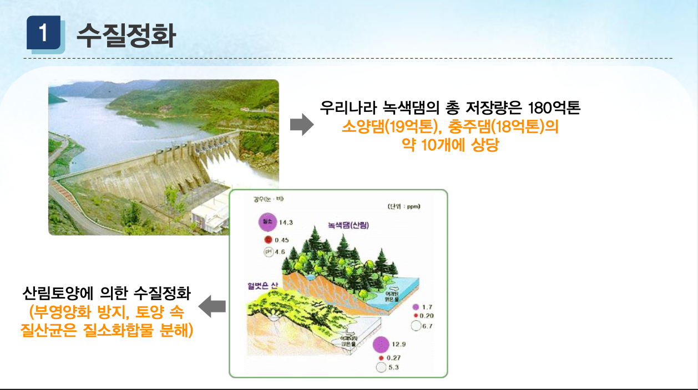
##### # 버섯
  - 지구 생톄계를 보존시키는 매우 중요한 생물
  - 식물의 유체를 분해시켜 나무의 영양분 공급, 다양한 생물이 서식할 수 있는 환경 조성
  - 지구상에 알려진 버섯 종류는 5,000~6,000종, 주로 식용으로 이용되었으나 항암제, 민간약재, 건강보조식품 등으로 사용
  - 버섯을 재배는 종류에 따라 상수리나무, 미루나무 등 원목이 다름
##### # 버섯의 인공재배 원목활용
|주재료|버섯종류|
|:-:|-|
|원목 참나무|표고,영지,목이,상황버섯|
|미루나무|느타리|
|볏짚류,소나무|복령,잣버섯|
|생볏짚|느타리,풀버섯|
|발효퇴비|양송이,신령버섯|
|폐면|느타리,풀버섯|
|톱밥,참나무|만가닥버섯,영지,목이,표고|
|플라타나스|느타리,팽이|
|미송|버들송이|
|곤충누에|동충하초|

##### # 목재
  - 건축용재
    - 용재 중에서 가장 많은 양 차지
    - 기둥, 대들보, 마루판자 등 사용되는 부분에 따라 수종 다름
    - 목조건물에서는 골조로 사용되며, 짜 맞추는 방식이므로 결구력이 우수한 나무 사용
     토대 : 느티나무, 밤나무, 이깔나무, 비자나무, 편백, 삼나무 등
     기둥 : 소나무, 잣나무, 이깔나무, 삼나무, 솔송나무, 전나무 등
     대들보 : 편백 등, 마루판자 : 소나무 등 사용

##### # 목공용재
   - 과거에 비해 목재가구는 사용률은 낮아졌으나, 자연 소재이므로 친환경적
     가구용재 : 편백 삼나무, 참나무, 느티나무, 오동나무 등
     악기용재 : 뽕나무, 벚나무, 오동나무, 느티나무, 자작나무, 가문비나무 등
     운동구용재 : 호두나무 계수나무, 너도밤나무, 박달나무, 밤나무, 물푸레나무 등
     문구용재 : 뽕나무, 벚나무, 오동나무, 느티나무, 자작나무, 가문비나무 등
##### # 공예용재
  - 나무의 결이 아름답고 단단하며 틀어지지 않는 나무로 사용
     느티나무, 단풍나무, 벚나무, 후박나무, 느티나무, 오동나무, 사시나무, 황칠나무, 오리나무, 너도밤나무 등
##### # 일상생활 도구
  - 소반, 함, 떡살 떡살과 다식판, 머리빗, 나막신, 담뱃대, 약장, 목기와 같은 민구(民具)
  - 생활주변에서 쉽게 구할 수 있고, 제작과 가공이 쉬운 나무가 주로 사용
     고급소반 : 은행나무,
     일반 소반 : 피나무, 단풍나무, 대추나무 등 사용
     함 : 은행나무, 잣나무, 회나무 등
     떡살, 다식판 : 잘 갈라지지 않는 참나무, 소나무, 박달나무 등

#### 참고 : 민구 民具 :
> 예로부터 민중이 일상생활에서 써 온 도구나 기구. 공예품에 상대하여 실용적인 농기구, 문방구, 상구(商具), 놀이 기구 따위를 이른다.
> 民: 백성 민
  具: 갖출 구

  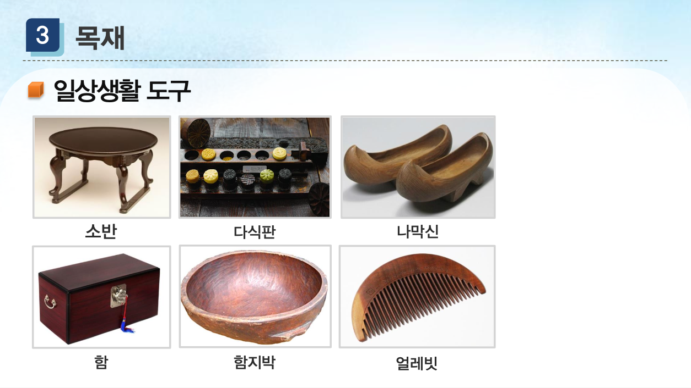

##### # 종이
  - 종이란 식물의 섬유세포를 기계적,화학적, 기계+화학적인 방법 등의 조합으로 분리한 펄프를 물에 풀어 평평하게 얽어서 필기,인쇄,포장 등에 사용 하는 것
  - **종의의 기원과 역사**  
    - 인류문명의 발달은 문자발명에 뒤이은 종이 및 인쇄술의 발명으로 인하여 이루어짐
    - 점토판,파피루스,갑골문 등 기록매체를 개바랗여 사용하였으나 보관이 번거롭고 무거운 한계
    - 파피루스는 식물의 외피로 만든 것으로 종이와 유사한 기록지이나 엄밀한 의미의 종이가 아님
    - 우리나라 제지기술은 중국을 통해 4~5세기경에 건너왔으며,
      610년 고구려의 승려 담징에 의해 일본으로 전파
    - 우리나라는 닥나무·삼지닥나무 등이 원료로 사용

##### # 종이의 원료
  - 펄프는 초본류와 목본류 등 다양한 재료가 이용
  - 종이의 원료는 98% 이상이 목재, 이 밖에 바가세, 케나프, 짚 등이 사용
  - 제지용 펄프 목재 : 유칼립투스, 포플러, 너도밤나무, 자작나무, 참나무 등
  - 종이소비
    - 1년 동안 985만 톤의 종이를 사용(2016년 말 통계)
    - 1인당 30년생 원목 3그루 자르는 셈

##### # 목재바이오매스
  - 바이오매스와 목재바이오매스
  - 바이오매스
    - 생명체에 의해 만들어진 유기물체의 총칭
    - 녹색식물, 수중식물, 동물 물고기 등을 포함해서 일컫는 말
    - 식물이나 미생물 등을 에너지원으로 이용하는 생물체

  - 목재 바이오매스
     수목의 줄기, 가지, 잎, 뿌리를 대체에너지원으로 사용
     열분해, 가스화, 액화 등의 열화학적인 방법과
    미생물효소를 이용한 생화학적인 방법을 이용하여
    목탄, 가스, 알코올 생산
     목재 바이오매스를 에너지원으로 이용하는 것으로
    목재 펠릿과 목재칩이 있으며, 주로 난방용으로 사용 
  - 목재 펠릿의 쓰임새
  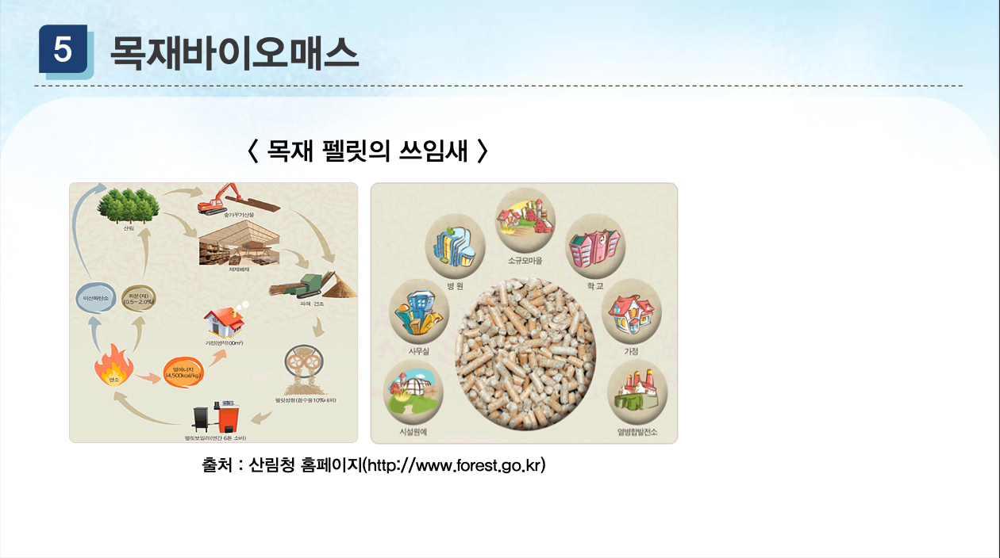

  - 목재팰릿의 친환경성
    - 목재 바이오매 스는 기후변화협약에서 CO2를 배출하지 않는 것으로 인정 받는 친환경 연료
    - 산성비의 산성비의 원인이 되는 황산화물(Sox)나 질소화합물(Nox)을 거의 배출하지 않는 청정 연료

|측정항목|환경부기준|목재팰릿|경유|
|--|--|--|--|
|황산화물(Sox)|100|1|22|
|질소산화물(Nox)|150|10|135|

## # 2강
#### 2.3 조절서비스의 숲
##### # 수원함양
  - 숲은 큰비나 눈이 내리는 증수기(增水期)에 일시적으로 
    물을 저축해서 출수(出水)되는 양을 줄여 주워 홍수를 완화시킴
  - 갈수기에는 물을 마르지 않고 일정한 유량(流量) 유지
  - 숲의 토양은 공극이 많아 그 공간에 물이 저장되며, 최대 물흡수량을 침투능이라고 함
  - 숲에서 빗물이 침투되는 침투 강도는 토양공극의 차이, 지피 상태, 지표 경사, 토양 수분, 우량 강도 등에 따라 다름
    - 지피 상태에 따른 **침투능력**은 초지의 2배, 붕괴지의 2.5배, **보도의 20배 정도** 차이
    
##### # 수원함량
  - 숲이 빗물을 머금었다가 서서히 흘려 보내는 인공댐과 같은
        기능을 한다고 하여 **녹색댐**이라고 함
         녹색댐 기능 : 홍수조절기능, 갈수완화기능, 수질정화기능 등
         녹색댐 기능은 침엽수림보다 활엽수림이 높음(낙엽분해 속도)
  - 건강한 산림은 민둥산에 비해 **3.4배**, 빈약한
        산림에 비해 **2.5배** 많은 물을 토양 내에 침투
  - 나무의 나이가 많을 수록 낙엽 및 뿌리의 양
        증가로 유기물이 많아지므로 물 저장 능력 커짐

    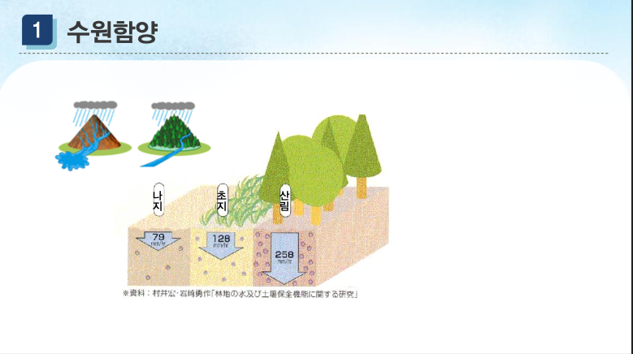

##### # 토사의 유출 및 붕괴 방지
  - 토사유출은 토층을 얇게 만들며, 양분을 함유하고 있는 세토(細土)가
    흘러내려 토지의 생산력을 잃게 됨

  - 나무가 우거져 있으면 저수능력이 강해짐
     나무뿌리가 그물 모양으로 땅속에 퍼져 흙과 물을
    밀착시킴으로써 흘러내림 방지
  
  - 연간 ha당 토사 유출량
     활엽수림지 : 0.7톤
     침엽수림지 : 1.0톤
     사방지 : 2.2톤 정도

  - 토사붕괴는 대형 재해 발전할 가능성이 높으므로 산림이 가진 기능 중에 매우 중요
  - 토사 붕괴량은 나무가 있는 산림에 비해 
    **나무가 없는 산림에서 1.8배 높은 것으로 조사 됨**

##### # 대기정화
  - 화석연료, 인간이 석탄이나 석유를 사용하면서 대기 중에
    이산화탄소 배출ㆍ증가
  - 온실효과를 방지를 위해 이산화탄소의 발생량을 줄이거나
    녹색식물을 통하여 이산화탄소의 제거에 노력
  - **0.5kg의 나무**의 무게가 증가하는 동안 수목은
    **약 0.75kg의 이산화탄소 흡수, 
    0.6kg 정도의 산소 방출**
         노령임분, 과밀임분은 수목의 성장이 느려산소 흡수량보다 방출량이 많아져 수종갱신 필요
  - **기후조절효과**
  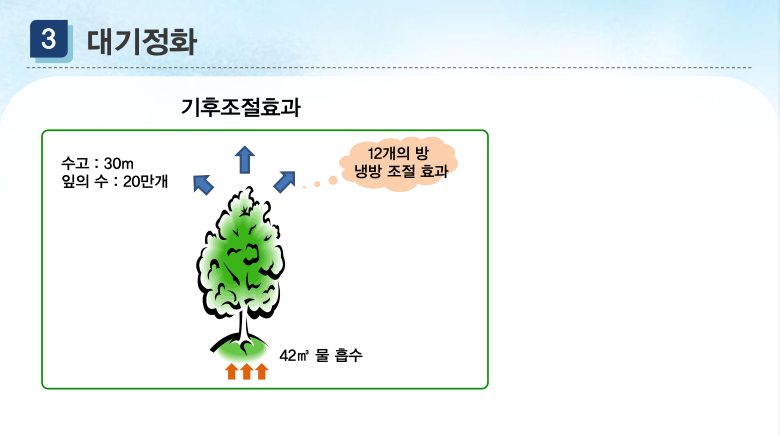

  - **대기오염물질의 흡수**
     이산화황(SO2) : 최근 연간배출량의 약 13% 흡수 효과
     이산화질소(NO2) : 최근 연간배출량의 약 8.1% 흡수 효과

  - **임상별 대기오염(SO2, NO2) 물질 흡수**
     **활엽수림 > 혼합림 > 침엽수림의 순**

  - 교목은 다른 식물에 비해 흡착력이 높으나
    **수종과 잎의 질·위치·밀생도·나이**에 따라 다름
    **교목 > 관목 > 잔디 > 일반농작물**
##### 참고 : 관목 灌木 :
> 키가 작고 원줄기와 가지의 구별이 분명하지 않으며 밑동에서 가지를 많이 치는 나무. 무궁화, 진달래, 앵두나무 따위이다.

> 灌: 물댈 관
木: 나무 목 모과 모

  - **미세먼지 저감효과**
     - 미세먼지는 대기 중에 부유하는 분진 중 직경 2.5㎛보다 작은 입자(PM2.5)를 말함
    - 미세번지 발생원인은 자연적인 원인과 인위적 원인으로
      구분되는데 자동차, 발전소, 보일러 등 연료를 태워 발생하는 배출물이 주원인

  - **식물에 의한 미세먼지 저감 효과**
    - 식물의 가지와 잎 표면에 흡착효과로 화학적 흡착이 아닌 입자상 물질의 물리적 침적이라고 할 수 있음
    - 침강효과, 바람에 의한 물리적 충돌, 강우에 의한 침적 등 세 가지 메커니즘
    - 이러한 물리적 메커니즘은 미세먼지의 크기에 따라
      결정되면, **표면적인 넓고**, **표면이 거칠고 복잡할수록**
      유리한 것으로 판단됨

    - 자작나무를 식재한 후 PM10 농도 변화를 측정한 결과 50% 감소한 연구결과
    - 베이징 서산시의 나무 6종의 PM2.5의 흡착 능력을 연무제 재생기를 사용하여 연구한 결과 PM2.5 흡착 능력 관찰
        ** 백송> 버드나무 > 은행나무 > 사시나무(Populusdavidiana )** 순으로 나타남
    - 현재 이 분야의 국내연구는 많지 않음

##### # 복사열조절, 연중 최대 온도변화를 줄여주는 효과
  - **복사열 조절, 연중 최대 온도변화를 줄여주는 효과**
  - **숲은 지표면에 직접 내리쬐는 일사와 지표면으로부터 복사열 조절**
     숲은 **일사량의 90%**정도 **흡수**하고 연중 최대 온도변화 줄여주는 효과
  - **습도**
     **숲 밖보다는 숲 속이 높으며 숲이 무성할수록 효과 큼**
     **낙엽활엽수림** 내 **연평균 2~3% 다습**,
      **침엽수림** 내 **5~10% 다습**
  - **바람**
     수관의 밀도, 수고에 따라 다르나 산림 내부의
    풍속은 숲의 가장자리부터 거리에 따라 감소

##### # 동식물 서식처 제공
  - 숲은 나무뿐만 아니라 곤충, 조류, 어류 등
    야생생물에게 삶의 터와 먹이를 제공해 주는
    중요한 장소
  - 식물은 대기에 있는 모든 산소를 생산하고 광합성을
    통해 식량을 제공하고 모든 생명체를 지지해 주는
    서식처(교재 2-3) > 생산,소비,분해
  - 기후변화로 인한 생물종 감소 및 번식량의 변화

 ##### # 생물다양성 보전
  - 숲 생태계는 종의 보전에 그치지 않고 다양한
유전자의 보전을 통해 인류가 지구에 생존하는 한
매우 중요한 기능 담당
생물 다양성의 보전기능은 매우 중요한 유전자의
보전과 생물종의 보전, 생태계의 보전을 통해
미래의 야생동물 보호나 천연기념물 보호도
그 기능에 부가되어 생물 다양성 보전기능 담당

#### 2.5 문화서비스의 숲
##### # 자연환경보전과 휴양장소 제공
  - 자연경관에서 볼 수 있는 선, 형, 색체, 구조, 비례, 운율이
    있어 기쁨과 만족감 제공(지형, 암석, 물, 식물, 동물 등)
  - 정신적인 긴장과 스트레스로부터 벗어나 정신적인 휴식과
    육체적인 건강을 얻기 위한 야외활동이 증가
  - **자연휴양림, 공원** 등 숲을 방문함으로써 **심신 건강**,
    사회에 대한 **순응력**, 자연에 대한 지식을 배우는 기회 증가

##### # 보건효과
  - **살균작용**
    - **피톤치드(phytoncide) 효과**
         식물의 살균작용, **테르펜**의 방향물질의 발산
         미생물번식이나 생장에 영향을 줌
  - **숲에서 발산되는 정유류의 성분 :**
     사람의 정서 안정
     유해한 미생물 살균
     정유성분 중 **테르펜(terpene)** 은 침엽수에 50종류 이상 함유

  - **요양효과**
    - 숲은 인간의 건강을 보호하고 질병을 예방하는 효과
    - 숲의 다양한 요소를 활용한 신체면역력 증진
         숲의 고요함, 자연적인 경관, 일상에서의 탈출감, 숲의 색채 등
         신체치유 : 숲의 기상, 흐르는 물, 울퉁불퉁하고 가파른 길
         감각기관 자극 치유 : 푸른색, 향기, 흙의 감촉, 맑은 물소리

##### # 일상생활과 숲문화
  - 꽃과 나무를 소재로 한 문학작품 및 노랫말
         개화기 이후 현대시 100명이 쓴 7,618편 중
          수목언급횟수 554회, 87편의 시는 수목을 주제로 함
         현대시에 주로 소재로 사용된 수목의 종류로는
          소나무, 진달래, 버드나무 순으로 나타남

  - 민담, 속담 등에 등장하는 꽃, 나무, 숲
    예> 잘 자란 나무는 떡잎부터 알아본다.

  - 전통혼례에 사용된 소나무, 대나무, 마을을 지켜주는 당산목 등

##### # 문화유산
  - 사적, 문화재, 천연기념물의 숲 또는 나무
     황룡사 9층 목탑, 봉정사 극락전, 수덕사 대웅전,
        부석사 무량수전(느티나무, 소나무 주로 사용)

     팔만대장경 : 산벚나무, 돌배나무, 단풍나무, 후박나무 등
        주변에서 쉽게 구할 수 있는 나무

  

##### # 환경교육
  - 자연으로부터 격리된 채 교실, 실험실, 도서관과 같은
    실내에서 이루어지는 교육이 중심
  - 환경교육은 개인뿐만 아니라 사회, 인간을 포함한 지구환경에
    영향을 줄 수 있기 때문에 매우 중요
  - 숲에는 자연과 역사에 대한 정보가 담겨져 있음
         동물·식물 등 숲을 구성하고 있는 인자들이 어떤
        관계를 가지고 있는지, 역사·문화적인 유적들을 통해
        선인들의 삶의 방식을 이해함으로써 살아 있는 교육을
        받는 곳

#### 2.6 우리나라 숲의 공익적 가치
  - 우리나라 산림의 공익적 가치는 126조 원으로 추산(2014년 기준)
    산림의 혜택은 국내총생산(GDP)의 8.5%
    ‘**토사 유출 방지기능**’이 **총 평가액의 14.4로 가장 높은 비중**
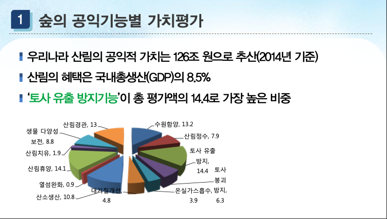
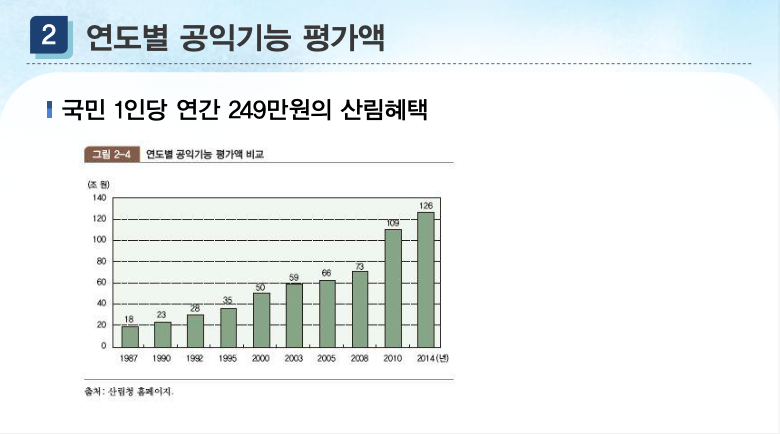

### 3강
#### 3.1 우리나라 숲의 현황

##### # 산림면적 및 임목축적
  - **우리나라 산림면적은 633만 4천ha로 국토면적**의 **63.1%** (2015년 말 현재)
  - 황폐된 산림이 1960년 이후 조림사업으로 녹화에 성공한 국가
  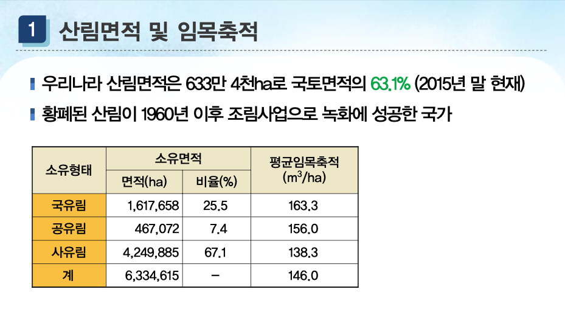
  - 최근 10년간 산림면적의 변화 추이는 **용도전환**으로 인한 면적 감소
  - 2010~2015년 동안 3만 4,228ha(0.54%) 감소, 5년간 연평균 약 6,846ha
(여의도면적 약 24배)씩 산림 감소
  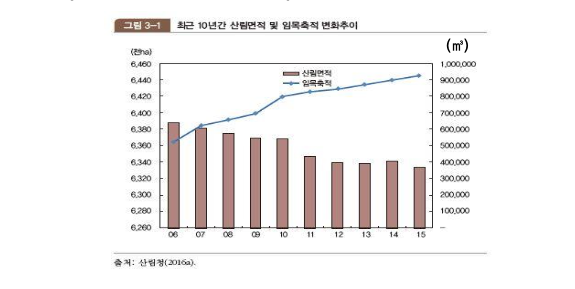

  - **임상별(林床別) 산림면적**
   ** 침엽수림: 36.9%, 활엽수림: 32.0%, 혼합림: 26.9%**

  - **임목축적**
     2015년 말 현재 9억2천5백만㎡로 ha당 **평균축적은 146.0㎥**
     일본, 독일, 스위스, 뉴질랜드에 비해 낮은 편

  - OECD 회원국과 비교한 우리나라 산림비율
     핀란드-일본-스웨덴-한국의 순

  - 수목 나이별 비율
     31년생 이상 : 69.1%

  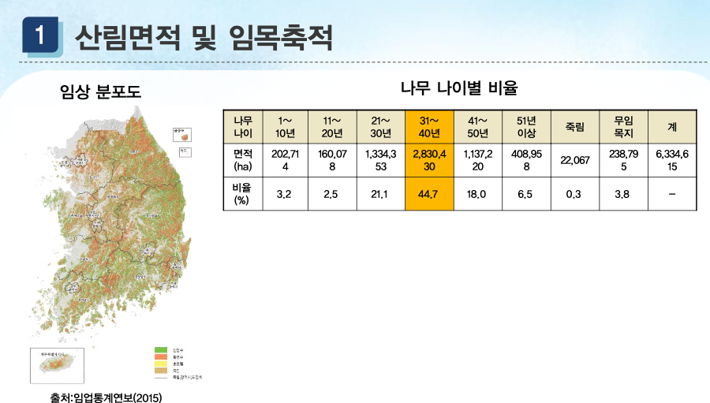

  - **산림기능별 산림면적**
  
|산림기능 구분|면적(ha)|비율(%)|
|:----:|:-----:|:--:|
|수원함양림 |910,537| 14.2|
|산지재해방지림|512,262|8.1|
|자연환경보전림| 1,377,760|21.7|
|목재생산림| 2,324,711|36.7|
|산림휴양림| 584,565|9.2|
|생활환경보전림| 333,030|5.3|
|기타| 300,750|4.8|
|계| 6,334,615|-|

##### # 산림자원의 생산과 이용
  - **목재수요**
    - **목재생산량** 은 **51%(2015년 말 현재 )** 를 차지하고 있으나,
      목재 소비 증가로 **자급률 16.1%**, 80% 이상 수입에 의존
    - 목재제품 수입량 (2015년 기준),
         **펄프 44.1%로 가장 큰 비중**
         합·단판용 : 12.9%
         **목재펠릿 등 산림 바이오매스 : 12.7%**
         보드류 : 9%
  - **임산물 생산**
    - 목재, 수목, 낙엽, 토석 등 산림에서 생산되는 산물과 조경수, 분재수 등 
      수출보다 수입에 의존 **(목재류 67.3%)**

  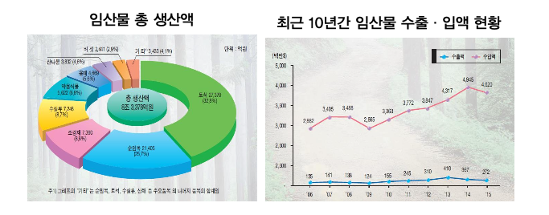
  - **산림 바이오에너지**
    - 산림 바이오매스는 숲 가꾸기 사업장에서 발생되는
        목재자원을 수집하여 파쇄하거나 건조·압축을 통해
        바이오 에너지의 원료로 공급(목재펠릿, 목재칩)
    - 신재생에너지 확보를 위해 산림 바이오매스 활용
        촉진 사업 활발히 진행
    - 목재펠릿 국내 생산량 :
        2015년 8만 2,000톤, 2016년 5만 5,000으로
        아직 불안정, 수입의존

#### 3.2 해외 숲의 현황
##### # 세계의 산림분포
  - 세계의 총 산림면적은 **세계 육지면적의 31%** (2015년 기준)
  - 산림이 많은 상위 10개국에 지구 **산림의 67% 편중**
     **러시아, 브라질, 캐나다, 미국, 중국 5개국에 54% 분포**

  - 대륙별 산림면적 분포
     **지구전체 산림면적 중 유럽 25.4% 점유** << 러시아 비율이 높음
     **남미 21.1%**
     **북중미 18.8% 분포**

  - 산림면적이 높은 상위 10개국 
  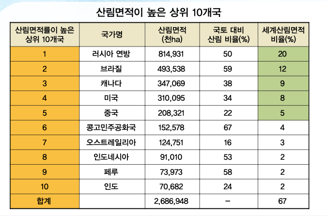

###### # 세계 산림면적과 임목축적
  - 산림면적이 큰 대륙 : 유럽
  - 산림비율 높은 대륙 : 남미
  - 임목축적
     세계 평균 임목축적 : **129m3/ha**
     오세아니아 : 202m3/ha
  - OECD 국가 중 산림 비율 60% 이상 되는 국가
     핀란드 73.1%, 일본 68.5%
     스웨덴 68.4%, 한국 63.2%

##### # 우리나라 vs 세계
 산림비율 : 63.1% vs 31%
 임목축적 : 146.0㎥/ha  vs 129㎥/ha

  - **대륙별 산림면적과 임목축적**
  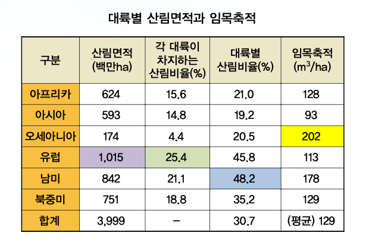

  - 세계의 산림면적은 1990~2010년 동안 5,200만ha 감소
  - 아프리카와 남아메리카 대륙의 산림용도 전환 및 목재자원의 공급을 위한
    열대림 개발로 인한 산림면적의 지속적인 감소 우려
  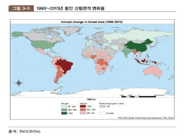

  - **천연림 감소, 인공림 증가 추세**
     유럽과 오세아니아는 감소량에 큰 변화가 없는 반면
     아프리카와 남미는 1990년 이후 현저하게 감소
     유럽의 천연림 중 러시아 85% 차지
  - **천연림의 경우 1990년대 연간 약 1,060만ha가 감소하였으나**
  - 최근 5년간(2010~2015년)의 감소량은 **연간 650만ha감소**, **인공림 증가 추세**

  

##### # 북한의 산림
  - 북한의 국토면적 중 산림이 차지하는 비율 : 41.9% (2014년 말 현재)
  - 매년 산림면적이 감소하는데 14년 동안 매년 약 12만 7,000ha 감소
   (평양시 면적의 규모 해당)
     산림면적 : 1999년~2008년 17만ha감소
     입목지 면적 : 1999년~2008년 138만ha 감소
     황폐산림면적 : 1999년~2008년 121만ha 증가

  - 북한의 산림황폐로 인해 멸종위기에 처한 야생 동식물은
  - 포유류 10종, 어류 17종, 조류 27종, 식물 17종이 보고 됨
  - 북한의 사회경제적 실정상 북한의 노력만으로 황폐산림 복구 어려움
  - **산림훼손- 농지황폐화- 식량부족의 문제점 해결이 선결**
  - 한반도의 국토환경 관리를 위해 복구를 위한
    남북간의 공동대응 필요

